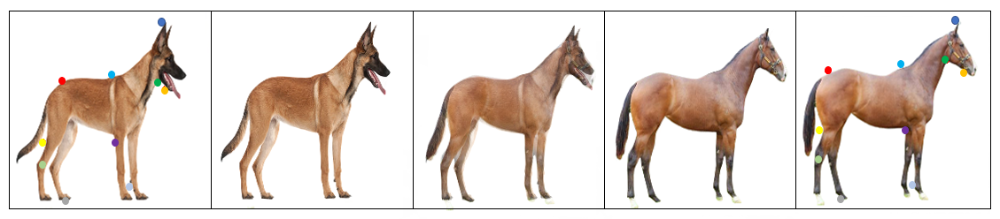

# morphing sequence cross-domain correspondence in PyTorch

This is our PyTorch implementation for the NBB's Extension :  morphing sequence between images using cross-domain correspondence paper.

This extention code to the NBB's algorithm was written by [Tal Hadar]  , [Matan Richker], [Jonatan Hadas] 

**NBB's Extension :  morphing sequence between images using cross-domain correspondence: [Project](https://github.com/talhadar1/NBBs_extension_morphing_sequence_using_cross_domain_correspondence) |  [Paper](https://arxiv.org/pdf/1805.04140.pdf)**




The original Neural Best-Buddies: Sparse Cross-Domain Correspondence code written by:
[Kfir Aberman](https://kfiraberman.github.io/), [Jing Liao](https://liaojing.github.io/html/), [Mingyi Shi](https://rubbly.cn/), [Dani Lischinski](http://danix3d.droppages.com/), [Baoquan Chen](http://www.cs.sdu.edu.cn/~baoquan/), [Daniel Cohen-Or](https://www.cs.tau.ac.il/~dcor/), SIGGRAPH 2018.
**[Project](http://fve.bfa.edu.cn/recap/nbbs/) |  [Paper](https://arxiv.org/pdf/1805.04140.pdf)**

## Prerequisites
- Linux or macOS
- Python 2 or 3
- CPU or NVIDIA GPU + CUDA CuDNN

### Run

- Run the algorithm (demo example)
```bash
#!./script.sh
python3 main.py --datarootA ./images/original_A.png --datarootB ./images/original_B.png --name lion_cat --k_final 10
```
The option `--k_final` dictates the final number of returned points. The results will be saved at `../results/`. Use `--results_dir {directory_path_to_save_result}` to specify the results directory.

### Output
-morph sequence:
- morph_path.txt					, morph_dijkstra.txt
- morph_path_domain_manipulation.txt, morph_dijkstra_domain_manipulation.txt 

### Next Step
- Take this path files and insert them as is to the morphing folder and execute the morphing program.

### Tips
- you can set the domain manipulation parameter to any disierd number. it will divide the distancess between intra-domain images.
- If you are running the algorithm on a bunch of pairs, we recommend to stop it at the second layer to reduce runtime (comes at the expense of accuracy), use the option `--fast`.
- If the images are very similar (e.g, two frames extracted from a video), many corresponding points might be found, resulting in long runtime. In this case we suggest to limit the number of corresponding points per level by setting `--k_per_level 20` (or any other desired number)


